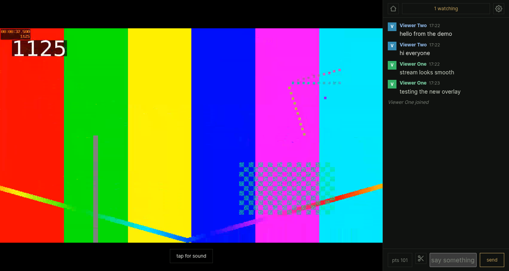
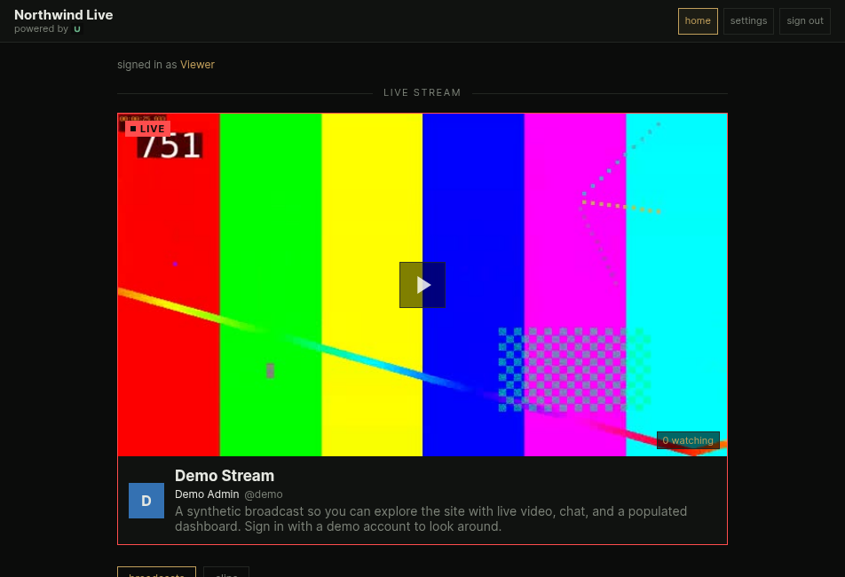
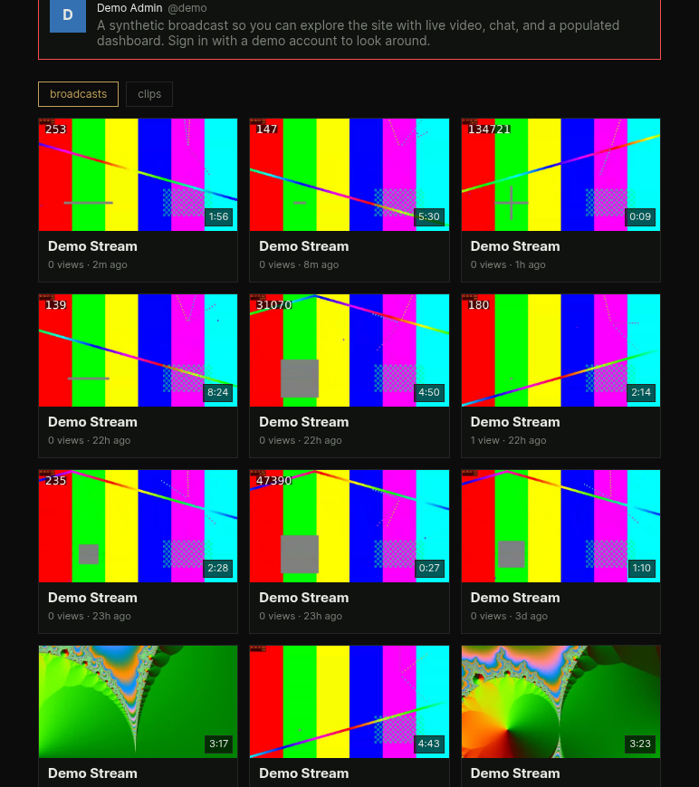
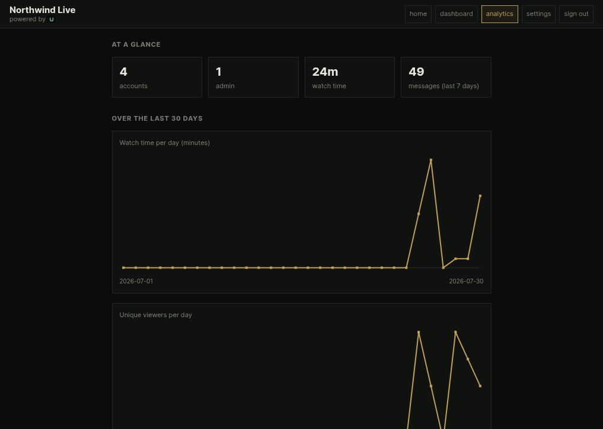

# upperroom

Launch your own streaming site. Self hosted, single channel live streaming with
accounts and chat: you broadcast from OBS, your viewers open one link, sign in,
and watch in 1080p60 with live chat and a list of who else is watching. No third
party streaming service, and nobody gets an account unless you made it or handed
them an invite. You can also hand out a guest pass to let somebody watch for a
while without one, or share a single clip publicly. It runs on a server you
control, at your own domain.

Current version: **0.5.2**. Releases are tagged in git, and the running version
also shows in the dashboard footer and at `/api/status`.

## Screenshots

All taken from the built-in demo mode (`docker compose --profile demo up -d`),
so what you see here is what a fresh install looks like.

The watch page, with live video, chat, and viewer presence:



The home page while the channel is live:



Past broadcasts and clips, kept to whatever retention you configure:



The analytics page, composed entirely from data the site already has:



## What it does

It does not transcode. Your computer does the encoding inside OBS, so the server
only repackages the video and stays light.

### Watching

- Ingests your stream from OBS over RTMP and republishes it as low latency HLS,
  roughly two to five seconds behind live.
- Serves one watch page. No video leaves the server without a valid session.
- Live chat, a list of who is watching, and a count.
- Records every broadcast (a recording you can replay later), and lets viewers
  clip the recent stream. Past broadcasts and clips show in the library.
  The viewer picks how much to take (thirty, forty-five or sixty seconds), up to
  a channel-wide maximum you set. A clip captures the moment they pressed the
  button, not the moment they finished naming it. Both carry a view count.
- Recordings and clips replay with the chat that happened at the time, and a bar
  chart under the player shows when chat was busiest, so you can click straight
  to the loud parts.
- Signed-in viewers can like and comment on a recording or a clip. Those sit
  beside the chat replay rather than inside it: the replay is what was said
  live, comments are what people say afterwards.
- Any single clip can be published as a public link that works without an
  account. Private by default, admin only, one clip at a time, and revocable.
  Sharing from the clip's own page or from the dashboard copies the link, which
  looks like `https://your-domain/clip/<token>`. You can copy that link again at
  any time while the clip is shared, and stopping kills it permanently: sharing
  again mints a new one. A public clip is video only: no chat replay, no
  comments, and it never names who made it.
- A theater mode for watching something together: put on a title from your own
  media library and everyone in the room watches it at once, with an
  intermission card between titles and a Now showing panel as each one starts.
  A small separate service (`projector/`) does the playing from whatever machine
  your library is on, and connects outward only, so that machine needs no open
  port. While a session runs nothing is recorded and clips are off. See
  `docs/11-theater.md`.
- Optionally restricts the whole site to a list of countries.

### Accounts

- The first time you open the site it hands you a short setup page that creates
  your admin account and names your site. The page seals itself afterwards.
- Invite codes let you hand out accounts without making them yourself. Generate
  a code on the dashboard, label it, and it works once. Whoever redeems it
  picks their own username and password and arrives as a viewer. Once a code
  has been used or revoked you can remove it, and there is a button to clear
  every spent code at once, so the list does not just grow.
- Guest passes are the other half of that: single use codes that let somebody
  watch and chat for half an hour without making an account at all. Generate a
  batch, copy them in one go, and send them to `/guest`. The clock starts when
  the pass is redeemed, not when you make it. A guest can watch and chat and
  nothing else, and can be timed out, banned and purged exactly like anyone
  else. Their account removes itself when the time is up.
- The guest form asks a small question to keep casual automation out. It is
  answered by the server itself: no third party, nothing phones home, and it
  works on a machine with no internet access beyond your own viewers.
- You can also create accounts directly from that page, for anyone who would
  rather not deal with a code.
- No account needs an email address. A viewer supplies one only if they want
  mail when you go live.
- Viewers get an avatar they crop themselves, a short bio, a display name they
  can change, and their own password.

### Chat and moderation

- An admin role and a separate moderator role, each with its own dashboard.
  Accounts, bans and invites live under People on the dashboard, alongside the
  channel settings. Only the account holder can change their own display name, and
  deleting an account makes you type its username first.
- Chat commands: `/timeout`, `/untimeout`, `/del`, `/purge`, `/ban`, `/unban`
  for moderators, plus `/mod` and `/unmod` for the admin. `/help` lists whatever
  the person typing it is allowed to use.
- Almost anything a command does, a click does too. Select a name in chat for
  timeouts, bans and promotions, or hover a line to delete just that one.
- Slow mode and a banned word list, both set in the dashboard. Chat starts at a
  2 second minimum between a viewer's messages, which you can raise or turn off.
  Moderators are exempt from slow mode, but not from the word list. A new
  install ships with a default list, which you own and can empty. Matching is
  whole word, so banning "ass" does not also block "class".
- Viewers pick their own name and message colors. The server rejects anything
  too dark to read, or close enough to the red reserved for the LIVE badge to be
  confusing.
- A handful of chat fonts, all self hosted. Nothing is fetched from anyone else.

### Making it yours

- Your site name leads the pages your viewers see, with a quiet "powered by
  upperroom" underneath. Set it in the dashboard.
- Four accent colors, applied site wide, including the browser theme color.
- Your stream key lives in the dashboard. Copy it, or regenerate it if it leaks,
  without touching a config file or restarting anything.
- A transparent chat overlay you add to OBS as a browser source, so the
  broadcast itself shows chat, joins, clips and highlights, with a live status
  chip and an optional operator ticker line. URL options move it to any corner,
  scale the text, and filter what it shows, and test buttons let you check it
  without waiting for a real viewer.
- Full-screen scene cards from the same overlay page for the moments around a
  broadcast: a Starting Soon screen with a countdown, Be Right Back, and Ending.
- Channel points, earned a point a minute for watching live, spent to highlight
  a short message on stream and on the overlay. Highlights show only while you
  are live.
- An analytics page with the running totals plus line charts of watch time,
  unique viewers and chat messages per day over the last thirty days.
- When you go live it can post to a Discord webhook, send email, or do neither.
  Email is opt in per account, and you are never mailed about your own stream.
- Set the time of your next stream and visitors see a countdown before they even
  sign in. An hour beforehand the same announcement goes out as a reminder.
- Installs to a phone home screen like an app, with a real icon and a link
  preview card.

### Keeping it running

- A storage panel showing how much disk the media is using, with limits on the
  number of recordings and clips, their age, and the total size on disk. Pin
  anything you want kept regardless. A fresh install keeps everything until you
  say otherwise.
- `manage.py backup` writes your accounts, chat, settings and avatars to a
  single archive, and `manage.py restore` puts them back. See
  `docs/10-backup.md`.
- The recorder watches itself. If ffmpeg dies or the file stops growing mid
  broadcast, it saves what it has and starts again, so one glitch does not cost
  you the whole stream.

## How it fits together

```
OBS (your PC)
  |  RTMP, firewalled to your address and accepted only with the stream key
  v
MediaMTX  ------------->  repackages to low latency HLS
  |
Caddy  --  checks the session cookie, and the country, before serving any video
  |  HTTPS at your domain
  v
Viewer's browser  --  sign in, then video plus chat plus presence
```

Three containers:

- `mediamtx` receives OBS and produces HLS. It asks `gate` whether a publisher
  is allowed in.
- `gate` is a small FastAPI service for login, sessions, chat, presence,
  recording and the dashboards.
- `caddy` terminates TLS, serves the pages, and guards the video and the
  recordings.

A fourth, `projector`, is optional and does not run here: it runs on whatever
machine holds your media library, connects outward to `gate` and `mediamtx`, and
plays titles into the channel for theater mode.

Demo mode adds three more, behind a Compose profile.

## Quick start

You need a small Linux server with a public IP, a domain you control, and a free
Cloudflare account. The tutorials in `docs/` walk through each part.

1. Prepare the server: `docs/01-vps-setup.md`
2. Point your domain at the server with DNS: `docs/02-cloudflare.md`
3. Copy the config and fill it in:
   ```
   cp .env.example .env
   ```
   Open `.env` and set every value. The file explains each one.
4. Build and start it:
   ```
   docker compose up -d --build
   ```
5. Open your domain in a browser. Because there are no accounts yet, it sends
   you to a setup page that creates your admin account and names your site, then
   signs you in. That page is gone for good once it has run.
6. Open the dashboard, copy the server address and stream key out of the Stream
   key panel, and paste them into OBS: `docs/03-obs.md`. Then go live.

If you ever lock yourself out, accounts can still be made from the command line.
That path is described in `docs/06-accounts-and-chat.md`. Everything else about
running and updating it is in `docs/04-run.md`.

## Try it (demo mode)

To see the whole thing working without OBS and without making any accounts,
bring it up in demo mode:

```
docker compose --profile demo up -d
```

You still need `.env` filled in and a domain pointed at the server, the same as
a real install. Set `PUBLISH_PASS` to something before you start: the demo
publisher uses it as the stream key, and if it is left blank there is no key to
publish with and no video appears.

That seeds a demo site and starts a synthetic broadcast, so within a minute you
have a live stream with a populated dashboard. It comes up as a site called
Northwind Live, streaming something called Demo Stream, with:

- `demo` / `demodemo123`, the admin.
- `viewer_one` and `viewer_two`, on the same password. One of them starts with
  enough channel points to redeem a highlight.
- An unredeemed invite code labeled "try me", so you can watch registration work
  from the login page.

The plain `docker compose up -d` never starts the demo containers, and the
seeder refuses to touch a database that has real accounts in it, so a live
install is unaffected. Credentials, teardown and the full details are in
`docs/07-demo.md`.

## Configuration

`.env` holds what the server needs in order to boot: your domain, the session
signing secret, the certificate email, how long a session lasts, the country
list, and an SMTP relay if you want go-live email. See `.env.example`, which
explains every value.

Everything about the channel itself lives in the admin dashboard rather than in
a file, so changing it is not a redeploy: site name, stream title and
description, accent color, longest clip and clip cooldowns, the stream key, the
overlay key and its ticker line, slow mode, banned words, the next stream, the
storage limits, and the Discord webhook.

## Security model

In short: the live stream and the recordings are served only to a valid session
cookie, and that cookie is only issued after a correct username and password, a
redeemed invite, or a redeemed guest pass. The ingest port requires the current
stream key, which you can rotate from the dashboard at any time. Passwords are
stored as scrypt hashes. An invite can only ever produce a viewer, never an
admin or a moderator, and a guest pass produces an account that can only watch
and chat and expires on its own.

There is exactly one deliberate exception, and it is worth stating plainly: a
clip you choose to publish is readable by anyone holding its link, with no
session. That is the point of the feature. It applies to one clip at a time, it
is admin only, it is off until you turn it on, and turning it off takes effect
at once. A published clip is video only, carries no chat replay or comments, and
does not name who made it.

Request sizes, sign-in attempts, guest-pass redemptions and chat connections are
all bounded per address, so the parts a stranger can reach cannot be used to
exhaust the server. The full explanation is in `docs/05-security.md`, and the
firewall rules are in `docs/01-vps-setup.md`.

## Documentation

The full set, in reading order:

1. Server setup: `docs/01-vps-setup.md`
2. Cloudflare and DNS: `docs/02-cloudflare.md`
3. Set up OBS: `docs/03-obs.md`
4. Run it and update it: `docs/04-run.md`
5. Security model: `docs/05-security.md`
6. Accounts, chat, and presence: `docs/06-accounts-and-chat.md`
7. Demo mode: `docs/07-demo.md`
8. The chat overlay: `docs/08-overlay.md`
9. Channel points: `docs/09-points.md`
10. Backing up and restoring: `docs/10-backup.md`
11. Theater and the projector: `docs/11-theater.md`

## License

GNU AGPL-3.0. See [LICENSE](LICENSE). Copyright (c) 2026 Lazarus Labs.

In plain terms: run it, modify it, and self-host it freely. If you host a
modified version for other people to use, you must share your modifications
under the same license. That last part is the point of the AGPL rather than the
plain GPL, and it matters here because this is software people reach over a
network. The "powered by upperroom" credit on every page links the developer's
site, which carries a Source on GitHub link for the project, and the footer on
every page names the AGPL-3.0 license and links its text. The dashboard footer
carries a spelled-out `source` link straight to this repository beside the
running version, and that stands as the AGPL section 13 written offer of source
to anyone using the running service.

Two carve-outs, both third-party and both unchanged by the above: the vendored
copy of hls.js in `web/assets/vendor/` is Apache-2.0 (see the README there), and
the bundled fonts are under the SIL Open Font License (see
`web/assets/fonts/OFL.txt` and `web/assets/fonts/INTER-LICENSE.txt`).

## A note on how this was built

This project was built with Claude Code. The code was largely written by the AI;
I specified what it should do, reviewed and corrected it, tested it, and made
the design and operational calls. I run it and I am responsible for it.
